# Canonical Enterprise ER Diagram — v3.0 (Image Synced)

## Workforce Management Web Application — Database Source of Truth

> This document is the **canonical database model** for all implementation phases.
> It supersedes all preliminary database plans and perfectly aligns with the approved 31-table ERD architecture.
> All migrations, models, repositories, and APIs must derive from this ERD.

### v3.0 Change Summary

Completely synchronized with the 31-table master schema provided. Replaced JSONB exception flags with a polymorphic table, introduced comprehensive finance, asset, and inventory domains, and refactored core relationships.

---

## 1. Full System ERD (Mermaid)

```mermaid
erDiagram
    %% Core Identity & Workforce
    employees {
        uuid id PK
        varchar employee_code
        varchar mobile_id
        varchar name
        uuid supervisor_id
        boolean is_active
        timestamp created_at
        timestamp updated_at
    }

    roles {
        uuid id PK
        varchar name
        text description
    }

    employee_roles {
        uuid employee_id FK
        uuid role_id FK
    }

    employee_rate_history {
        uuid id PK
        uuid employee_id FK
        varchar rate_type
        numeric rate_amount
        date effective_from
        date effective_to
        uuid changed_by
    }

    %% Clients & Projects
    clients {
        uuid id PK
        varchar name
        varchar contact_person
        varchar contact_mobile
        boolean is_active
        timestamp created_at
    }

    projects {
        uuid id PK
        uuid client_id FK
        varchar name
        varchar status
        date start_date
        date end_date
    }

    sites {
        uuid id PK
        uuid project_id FK
        varchar name
        text address
        geography location
        numeric permitted_radius_m
        uuid supervisor_id
        boolean is_active
    }

    employee_site_assignments {
        uuid id PK
        uuid employee_id FK
        uuid site_id FK
        timestamp assigned_at
        timestamp unassigned_at
        boolean is_active
    }

    %% Master Data (Activities & Materials)
    activities {
        uuid id PK
        varchar name
        varchar unit_of_measure
        numeric approved_rate
        varchar category
        boolean is_active
        timestamp created_at
        timestamp updated_at
    }

    materials {
        uuid id PK
        varchar material_code
        varchar name
        text description
        varchar unit_of_measure
        varchar category
        numeric purchase_approval_limit
        boolean is_active
        timestamp created_at
        timestamp updated_at
    }

    work_orders {
        uuid id PK
        varchar order_number
        uuid project_id FK
        uuid site_id FK
        text description
        jsonb target_quantities
        date start_date
        date end_date
        varchar billing_basis
        varchar status
        boolean is_active
        timestamp created_at
        timestamp updated_at
    }

    %% Operations (Attendance & Work)
    attendance_records {
        uuid id PK
        uuid employee_id FK
        uuid site_id FK
        date date
        int session_number
        timestamp check_in_time
        geography check_in_location
        numeric check_in_distance_m
        timestamp check_out_time
        geography check_out_location
        numeric check_out_distance_m
        boolean is_within_geofence
        numeric working_hours
        numeric overtime_hours
        varchar status
        uuid override_by
    }

    daily_work_entries {
        uuid id PK
        uuid attendance_record_id FK
        uuid employee_id FK
        uuid site_id FK
        uuid activity_id FK
        uuid work_order_id FK
        date work_date
        numeric quantity
        varchar unit
        text remarks
        varchar status
    }

    work_photos {
        uuid id PK
        uuid daily_work_entry_id FK "ON DELETE CASCADE"
        text image_url
        text thumbnail_url
        integer file_size_bytes
        timestamptz uploaded_at
    }

    verification_records {
        uuid id PK
        uuid attendance_record_id FK
        uuid daily_work_entry_id FK
        uuid verified_by
        varchar action
    }

    exception_flags {
        uuid id PK
        varchar entity_type
        uuid entity_id
        varchar flag_type
        boolean is_resolved
        uuid resolved_by
        timestamp created_at
    }

    %% Assets & Inventory
    asset_management {
        uuid id PK
        varchar asset_code
        varchar name
        uuid current_site_id FK
        boolean is_active
        timestamp created_at
    }

    asset_movements {
        uuid id PK
        uuid asset_id FK
        uuid from_site_id FK
        uuid to_site_id FK
        uuid moved_by
        timestamp moved_at
    }

    material_stock {
        uuid id PK
        uuid material_id FK
        uuid site_id FK
        numeric quantity_available
        numeric quantity_reserved
        numeric quantity_consumed
        numeric quantity_purchased
        timestamp updated_at
    }

    material_usage {
        uuid id PK
        uuid daily_work_entry_id FK
        uuid material_id FK
        varchar usage_type
        numeric quantity
        timestamp created_at
    }

    %% Finance & Billing
    payments {
        uuid id PK
        varchar payment_type
        numeric amount
        varchar currency
        date payment_date
        varchar method
        varchar status
        uuid recorded_by
        timestamp created_at
    }

    payment_source_records {
        uuid id PK
        uuid payment_id FK
        varchar source_type
        uuid source_id
    }

    payment_receipts {
        uuid id PK
        uuid payment_id FK
        numeric amount
        text receipt_url
        uuid recorded_by
        timestamp created_at
    }

    project_revenue {
        uuid id PK
        uuid project_id FK
        uuid client_id FK
        numeric received_amount
        varchar currency
        date period_start
        date period_end
    }

    expenses {
        uuid id PK
        uuid project_id FK
        uuid site_id FK
        varchar category
        numeric amount
        date expense_date
        uuid recorded_by
        timestamp created_at
    }

    invoices {
        uuid id PK
        varchar invoice_number
        uuid client_id FK
        uuid project_id FK
        uuid project_revenue_id FK
        numeric total_amount
        varchar currency
        date invoice_date
        date due_date
        varchar status
        timestamp created_at
    }

    invoice_line_items {
        uuid id PK
        uuid invoice_id FK
        numeric amount
        varchar source_type
        uuid source_id
    }

    client_payments {
        uuid id PK
        uuid payment_id FK
        uuid invoice_id FK
    }

    employee_payments {
        uuid id PK
        uuid employee_id FK
        uuid project_id FK
        uuid site_id FK
        date period_start
        date period_end
        numeric gross_amount
        numeric deductions
        numeric net_amount
        varchar payment_status
    }

    %% System
    audit_logs {
        uuid id PK
        varchar entity_type
        uuid entity_id
        varchar action
        uuid changed_by
        timestamp created_at
        jsonb previous_values
        jsonb new_values
    }

    notifications {
        uuid id PK
        uuid employee_id FK
        varchar channel
        varchar recipient_mobile
        text message
        varchar status
        timestamp created_at
        timestamp sent_at
    }

    %% Relationships
    employees ||--o{ employee_roles : "has"
    roles ||--o{ employee_roles : "assigned to"
    employees ||--o{ employee_rate_history : "rates"
    employees ||--o{ employee_site_assignments : "assigned"
    sites ||--o{ employee_site_assignments : "assigns"
    
    clients ||--o{ projects : "owns"
    projects ||--o{ sites : "contains"
    projects ||--o{ work_orders : "has"
    sites ||--o{ work_orders : "at site"
    
    employees ||--o{ attendance_records : "logs"
    sites ||--o{ attendance_records : "at"
    attendance_records ||--o{ daily_work_entries : "entries"
    employees ||--o{ daily_work_entries : "performs"
    sites ||--o{ daily_work_entries : "at"
    activities ||--o{ daily_work_entries : "type"
    work_orders ||--o{ daily_work_entries : "for order"
    
    daily_work_entries ||--o{ work_photos : "evidence"
    attendance_records ||--o{ verification_records : "verified"
    daily_work_entries ||--o{ verification_records : "verified"
    
    sites ||--o{ asset_management : "stores"
    asset_management ||--o{ asset_movements : "moves"
    sites ||--o{ asset_movements : "from/to"
    
    materials ||--o{ material_stock : "inventory"
    sites ||--o{ material_stock : "at site"
    daily_work_entries ||--o{ material_usage : "uses"
    materials ||--o{ material_usage : "material used"
    
    projects ||--o{ project_revenue : "generates"
    clients ||--o{ project_revenue : "pays"
    projects ||--o{ expenses : "incurs"
    sites ||--o{ expenses : "incurs"
    
    clients ||--o{ invoices : "billed to"
    projects ||--o{ invoices : "for project"
    project_revenue ||--o{ invoices : "reconciles"
    invoices ||--o{ invoice_line_items : "lines"
    
    payments ||--o{ payment_source_records : "sources"
    payments ||--o{ payment_receipts : "receipts"
    payments ||--o{ client_payments : "client pays"
    invoices ||--o{ client_payments : "pays invoice"
    
    employees ||--o{ employee_payments : "paid"
    projects ||--o{ employee_payments : "from project"
    sites ||--o{ employee_payments : "from site"
    
    employees ||--o{ notifications : "receives"
```

---

## 2. Entity Summaries

This schema consists of 31 exact tables derived from the architectural diagram. The system utilizes `geography` types for precise PostGIS tracking.

*Note: Identity (users, otp, refresh_tokens) tables are maintained separately by the auth layer, linking directly to the `employees` table via a user ID.*
